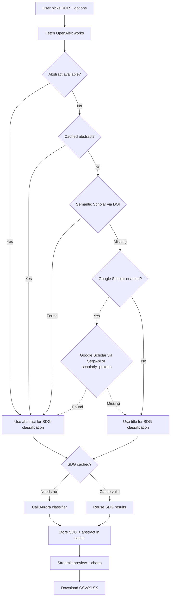

# Aurora SDG Publication Classifier

This Streamlit app helps you explore publications from the OpenAlex database for any ROR (Research Organization Registry) institution. It pulls the metadata, enriches missing abstracts, runs them through Aurora’s Sustainable Development Goals (SDG) classifiers, and gives you immediate visual and downloadable results.

## What you can do

- **Search institutions**: Enter a name or paste a ROR URL (e.g. `https://ror.org/02msan859`).
- **Set filters**: Choose publication types, SDG classifier models, time windows, and optional record limits.
- **Fetch SDG predictions**: The app calls OpenAlex for metadata and Aurora for SDG scores. Everything is cached locally in `cache.sqlite3` to avoid redundant network calls.
- **Enrich Abstracts**: If an abstract is missing in OpenAlex, the app automatically performs a fallback search against Semantic Scholar and Google Scholar (via SerpApi) to find it.
- **Inspect results instantly**: The “Preview” section shows 25 rows per page. You can select a single row to drive the SDG chart.
- **Visualize SDG coverage**: A donut chart aggregates SDG scores across all rows or a single selected publication.
- **Export data**: Download either a CSV or Excel file for the entire result set.

## Demo
A live demo is available at [Streamlit Cloud - Aurora SDG Publicaton Classifier](https://aurora-sdg-publication-classifier.streamlit.app). Note that the demo instance may have usage limits and could be slower due to shared resources.

## High-level workflow



## How it works in the background

1. **OpenAlex fetch**: We request the Works API using your selected ROR, date range, and publication type. The request uses a friendly User-Agent (set via `.streamlit/secrets.toml`) to comply with API guidelines.
2. **Caching**: Each returned record and SDG classification is stored in a local SQLite database (`cache.sqlite3`). When you rerun the query, previously fetched publications are loaded from the cache, so the Aurora SDG API is only contacted for new or uncached works.
3. **SDG classification**: Depending on the model you pick, abstracts or titles are sent to the relevant Aurora endpoint. Short abstracts are skipped when the model requires a minimum length (e.g., the OSDG model).
4. **Abstract enrichment**: If OpenAlex provides no abstract, we reuse any cached text, otherwise we perform a series of fallbacks:
    - **Semantic Scholar**: Called via its official API using the paper's DOI. Requires an optional API key.
    - **Google Scholar**: Uses [SerpApi](https://serpapi.com/) when a key is provided; otherwise falls back to `scholarly` with free proxies (less reliable).
5. **Exports**: A custom lightweight Excel writer assembles `.xlsx` files without additional libraries, ensuring easy downloads.

## Getting started

1. **Install dependencies**: `pip install -r requirements.txt`.
2. **Configure secrets**: Create a file named `.streamlit/secrets.toml` and add your configuration. See the "Configuring secrets" section below for details.
3. **Run the app**: `streamlit run app.py` from the project directory.
4. **Use the interface**: Search for an institution, choose your options, and press “Fetch works and build CSV.” Progress bars will show the status.
5. **Download your data**: After the fetch completes, you’ll see charts, a data preview, and buttons for Excel/CSV downloads.
   - Without a SerpApi key, Google Scholar lookups rely on `scholarly` plus free proxies; this can be slower or less reliable than SerpApi.

## Configuring secrets

The app relies on Streamlit’s secrets mechanism. Create a `.streamlit/secrets.toml` file with entries like:

```toml
# A descriptive User-Agent string, including a contact email, is required for OpenAlex politeness.
http_user_agent = "OpenAlex+Aurora SDG fetcher (mailto:you@example.com)"

# An optional API key for Semantic Scholar to improve abstract retrieval rates.
# See: https://www.semanticscholar.org/product/api
semantic_scholar_api_key = "YOUR_SEMANTIC_SCHOLAR_API_KEY"

# Enable Google Scholar abstract fetching. With a SerpApi key we'll use SerpApi; without it
# we fall back to scholarly + free proxies (less reliable).
# See: https://serpapi.com/ and https://github.com/scholarly-python-package/scholarly
google_scholar_enabled = true
serpapi_api_key = "YOUR_SERPAPI_API_KEY"


[advanced_options]
# Sets the default start of the publication date slider, e.g., "2020-01-01".
default_from_date = "2020-01-01"
```
- `http_user_agent` is required.
- `semantic_scholar_api_key` and `serpapi_api_key` are optional but highly recommended for reliable abstract retrieval (without SerpApi the app falls back to scholarly free proxies). 
- `google_scholar_enabled` controls the final fallback to Google Scholar.

A sample file is included at `.streamlit/secrets.sample.toml`.

## Privacy and data location

All data is downloaded to your machine. The cache file `cache.sqlite3` lives beside the scripts and is ignored by git. You can delete it at any time to force a fresh fetch.

---

Enjoy exploring how your institution’s publications map to the Sustainable Development Goals!
