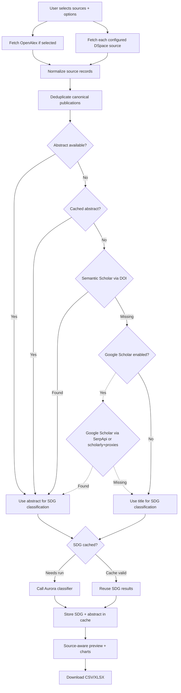

# Aurora SDG Publication Classifier

This Streamlit app explores publications from OpenAlex and any number of configured DSpace repositories. One run fetches every selected source, normalizes and deduplicates the records, enriches missing abstracts, runs each canonical publication through Aurora’s Sustainable Development Goals (SDG) classifiers once, and produces visual and downloadable results.

## What you can do

- **Select one or more sources**: Query OpenAlex, configured DSpace repositories, or both in one automated run.
- **Search OpenAlex institutions**: When OpenAlex is selected, search its institution registry or paste a ROR/OpenAlex institution URL.
- **Use generic DSpace sources**: Configure public DSpace REST APIs through repeatable `[[dspace_sources]]` entries. SWPS SHARE is the initial registry entry, not a special code path.
- **Set filters**: Choose publication types, SDG classifier models, time windows, and optional record limits. Limited multi-source results are selected newest-first after deduplication rather than by source order.
- **Deduplicate automatically**: Exact normalized DOI matches, or exact normalized title/year/first-author matches, are merged before enrichment and classification.
- **Fetch SDG predictions**: Canonical publications and classifications are cached locally in `cache.sqlite3` to avoid redundant Aurora calls.
- **Enrich abstracts**: If all selected source records lack an abstract, the app can fall back to Semantic Scholar and Google Scholar.
- **Inspect results instantly**: The “Preview” section shows 25 rows per page. You can select a single row to drive the SDG chart.
- **Visualize SDG coverage**: A donut chart aggregates SDG scores across all rows or a single selected publication.
- **Export data**: Download either a CSV or Excel file for the entire result set.
- **Keep media out of the pipeline**: DSpace thumbnails, artwork images, bundles, bitstreams, and metrics are neither requested nor embedded.

## Screenshots


SDG classification results with donut chart and data preview.


Co-affiliation network visualization based on publication data.


OA status of publication volume over time.

## Demo
A live demo is available at [Streamlit Cloud - Aurora SDG Publicaton Classifier](https://aurora-sdg-publication-classifier.streamlit.app). Note that the demo instance may have usage limits and could be slower due to shared resources.

## High-level workflow


```mermaid
flowchart TB
    A[User selects sources + options] --> B1[Fetch OpenAlex if selected]
    A --> B2[Fetch each configured DSpace source]
    B1 --> B[Normalize source records]
    B2 --> B
    B --> B3[Deduplicate canonical publications]
    B3 --> C{Abstract available?}
    C -->|Yes| D[Use abstract for SDG classification]
    C -->|No| E{Cached abstract?}
    E -->|Yes| D
    E -->|No| F{Semantic Scholar via DOI}
    F -->|Found| D
    F -->|Missing| G{Google Scholar enabled?}
    I -.->|Missing| H[Use title for SDG classification]
    G -->|No| H
    G -.->|Yes| I{Google Scholar via SerpApi or scholarly+proxies}
    I -.->|Found| D
    D --> J{SDG cached?}
    H --> J
    J -->|Cache valid| K[Reuse SDG results]
    J -->|Needs run| L[Call Aurora classifier]
    L --> M[Store SDG + abstract in cache]
    K --> M
    M --> N[Source-aware preview + charts]
    N --> O[Download CSV/XLSX]
```

## How it works in the background

1. **Source fetch**: OpenAlex uses the selected institution, lineage, date and publication type. Each selected DSpace API is queried independently with its configured Discovery profile, scope and entity types. When a record limit is set, each DSpace entity category contributes candidates before the global newest-first limit is applied. DSpace pages use metadata-only search results; media endpoints are never followed.
2. **Normalization and deduplication**: Source-qualified record IDs remain preserved while exact DOI or exact title/year/first-author matches become one canonical publication. Fuzzy similarity is not used for automatic merging.
3. **Caching**: `source_records` preserves raw source responses, `canonical_works` stores merged publications, and `sdg_results_v2` stores classifications with the hash of the classified text. Cache updates preserve accumulated provenance and richer abstracts when a later query uses fewer sources. The legacy `works` and `sdg_results` tables remain intact and are copied additively on first use.
4. **SDG classification**: Depending on the model, the selected abstract or title is sent to Aurora once per canonical publication. An unchanged text hash reuses the previous result.
5. **Abstract enrichment**: DSpace abstracts are read from both `dc.abstract*` and standard `dc.description.abstract*` metadata. The richer of current source text and cached text is reused before external fallbacks:
    - **Semantic Scholar**: Called via its official API using the paper's DOI. Requires an optional API key.
    - **Google Scholar**: Uses [SerpApi](https://serpapi.com/) when a key is provided; otherwise falls back to `scholarly` with free proxies (less reliable).
6. **Exports**: CSV and XLSX include canonical IDs, source-qualified record IDs, source URLs, source counts and provenance alongside the existing publication and SDG fields.

## Getting started

1. **Clone the repository**
   ```bash
   git clone https://github.com/jmiba/ERUA-publications.git
   cd ERUA-publications
   ```
2. **Create a virtual environment (recommended)**

    Mac OS/Linux:
    ```bash
    python3 -m venv .venv
    # Activate it on macOS/Linux:
    source .venv/bin/activate
    ```
    Windows (PowerShell):
    ```bash
    python3 -m venv .venv
    # Activate it on Windows (PowerShell):
    .\.venv\Scripts\Activate.ps1
    ```
3. **Install dependencies**:
   ```bash
   pip install -r requirements.txt
   ```
4. **Configure sources and secrets**: Public DSpace endpoints live in `dspace_sources.toml`. Create `.streamlit/secrets.toml` for API keys and optional local datasource additions or overrides.
5. **Run the app**:
   ```bash
   streamlit run app.py
   ```
6. **Use the interface**: Select one or more sources. If OpenAlex is selected, also select an institution. Then choose the remaining options and press “Fetch works and build CSV.” Retrieval, deduplication and classification happen automatically.
7. **Download your data**: After the fetch completes, you’ll see charts, a data preview, and buttons for Excel/CSV downloads.
   - Without a SerpApi key, Google Scholar lookups rely on `scholarly` plus free proxies; this can be slower or less reliable than SerpApi.

## Configuring secrets

The tracked `dspace_sources.toml` contains public endpoints and initially enables SWPS SHARE. Add repeatable `[[dspace_sources]]` tables there for other public repositories. Local `[[dspace_sources]]` entries in `.streamlit/secrets.toml` override matching IDs or add untracked instances.

The app relies on Streamlit’s secrets mechanism for API keys. Create a `.streamlit/secrets.toml` file with entries like:

```toml
# A descriptive User-Agent string, including a contact email, is required for OpenAlex politeness.
http_user_agent = "OpenAlex+Aurora SDG fetcher (mailto:you@example.com)"

# An optional API key for Semantic Scholar to improve abstract retrieval rates.
# See: https://www.semanticscholar.org/product/api
semantic_scholar_api_key = "YOUR_SEMANTIC_SCHOLAR_API_KEY"

# Enable Google Scholar abstract fetching. With a SerpApi key we'll use SerpApi; without it
# we fall back to scholarly + free proxies (less reliable).
# See: https://serpapi.com/ and https://github.com/scholarly-python-package/scholarly
google_scholar_enabled = true
serpapi_api_key = "YOUR_SERPAPI_API_KEY"

# Repeat this table for every public DSpace repository to expose in the UI.
[[dspace_sources]]
id = "swps-share"
label = "SWPS SHARE"
base_url = "https://share.swps.edu.pl/server/api"
configuration = "default"
enabled = true
entity_types = ["Article", "Book", "Artistic"]


[advanced_options]
# Sets the default start of the publication date slider, e.g., "2020-01-01".
default_from_date = "2020-01-01"
```
- `http_user_agent` is required.
- `semantic_scholar_api_key` and `serpapi_api_key` are optional but highly recommended for reliable abstract retrieval (without SerpApi the app falls back to scholarly free proxies). 
- `google_scholar_enabled` controls the final fallback to Google Scholar.
- `dspace_sources` is a repeatable list. Each `id` must be unique and becomes part of the source-qualified record key.
- `base_url` points to the DSpace REST root ending in `/server/api`; `scope` may optionally restrict queries to a community or collection UUID.
- DSpace `Article`, `Book`, and `Artistic` are source entity categories. More specific `dc.type` metadata is normalized where available, so a `Book` result can become `book-chapter`.

A sample file is included at `.streamlit/secrets.sample.toml`.

---

Enjoy exploring how your institution’s publications map to the Sustainable Development Goals!
