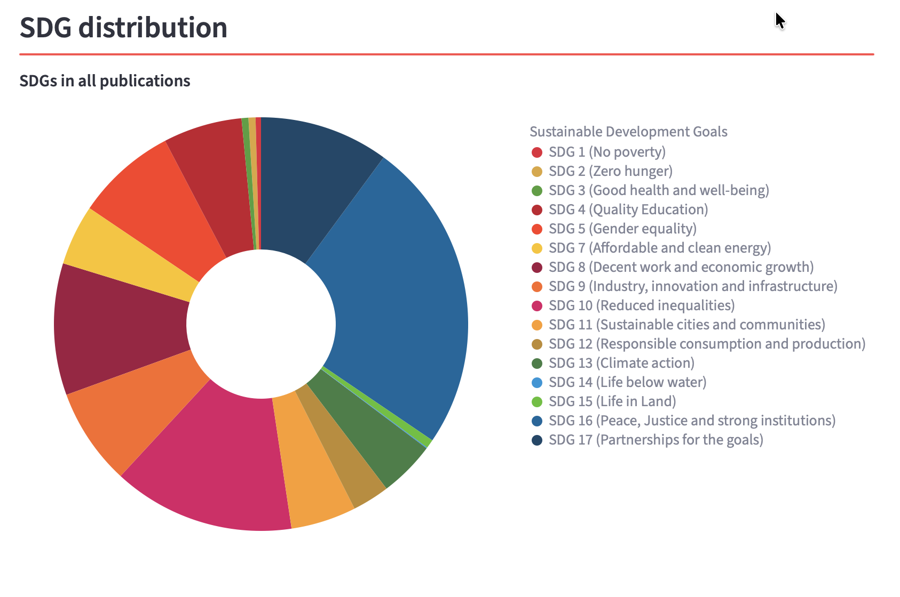
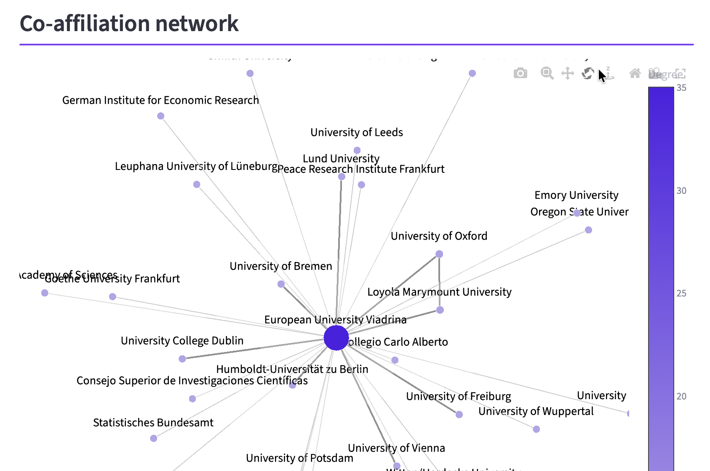
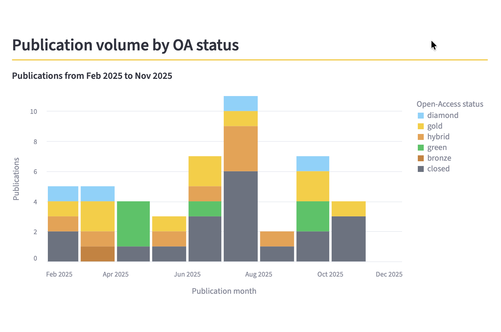
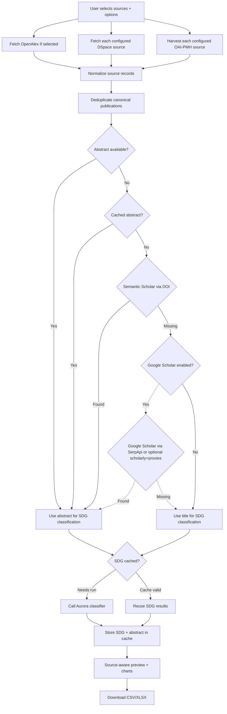

# Aurora SDG Publication Classifier

[](https://doi.org/10.5281/zenodo.22050496)

This Streamlit app explores publications from OpenAlex and any number of configured DSpace or OAI-PMH repositories. One run fetches every selected source, normalizes and deduplicates the records, enriches missing abstracts, runs each canonical publication through Aurora’s Sustainable Development Goals (SDG) classifiers once, and produces visual and downloadable results.

## What you can do

- **Select one or more sources**: Query OpenAlex, configured DSpace repositories, OAI-PMH repositories, or any combination in one automated run.
- **Link repositories to OpenAlex**: Repository sources can carry their OpenAlex and ROR institution IDs. When OpenAlex and a linked repository are selected together, the configured institution is used automatically. For an OpenAlex-only query, search the institution registry or paste an ID as before.
- **Use generic DSpace sources**: Configure public DSpace REST APIs through repeatable `[[dspace_sources]]` entries. SWPS SHARE is the initial registry entry, not a special code path.
- **Harvest OAI-PMH sources**: Configure standard OAI-PMH endpoints through repeatable `[[oai_sources]]` entries. The Viadrina OPUS publication server is included as the initial source.
- **Set filters**: Select one or more publication types, an SDG classifier model, a time window, and an optional record limit. Limited multi-source results are selected newest-first after deduplication rather than by source order.
- **Deduplicate automatically**: Exact normalized DOI matches, or exact normalized title/year/first-author matches, are merged before enrichment and classification.
- **Fetch SDG predictions**: Canonical publications and classifications are cached locally in `cache.sqlite3` to avoid redundant Aurora calls.
- **Enrich abstracts**: If all selected source records lack an abstract, the app can fall back to Semantic Scholar and Google Scholar.
- **Inspect results instantly**: The “Preview” section shows 25 rows per page. You can select a single row to drive the SDG chart.
- **Visualize SDG coverage**: A donut chart aggregates SDG scores across all rows or a single selected publication.
- **Explore co-affiliations**: Filter network nodes by case-insensitive label fragments, keep every selected institution as context, and optionally reveal the strongest partner-to-partner connections. A coverage note reports how many publications contain the two or more structured institution identifiers needed to form an edge; OAI-PMH Dublin Core records commonly omit these affiliations even though they remain available elsewhere in the app.
- **Export data**: Download either a CSV or Excel file for the entire result set.
- **Keep media out of the pipeline**: DSpace media endpoints and OAI-PMH file identifiers are never followed or embedded.

## Screenshots


SDG classification results with donut chart and data preview.


Co-affiliation network visualization based on publication data.


OA status of publication volume over time.

## Demo
A live demo is available at [Streamlit Cloud - Aurora SDG Publicaton Classifier](https://aurora-sdg-publication-classifier.streamlit.app). Note that the demo instance may have usage limits and could be slower due to shared resources.

## High-level workflow


```mermaid
flowchart TB
    A[User selects sources + options] --> B1[Fetch OpenAlex if selected]
    A --> B2[Fetch each configured DSpace source]
    A --> B4[Harvest each configured OAI-PMH source]
    B1 --> B[Normalize source records]
    B2 --> B
    B4 --> B
    B --> B3[Deduplicate canonical publications]
    B3 --> C{Abstract available?}
    C -->|Yes| D[Use abstract for SDG classification]
    C -->|No| E{Cached abstract?}
    E -->|Yes| D
    E -->|No| F{Semantic Scholar via DOI}
    F -->|Found| D
    F -->|Missing| G{Google Scholar enabled?}
    I -.->|Missing| H[Use title for SDG classification]
    G -->|No| H
    G -.->|Yes| I{Google Scholar via SerpApi or optional scholarly+proxies}
    I -.->|Found| D
    D --> J{SDG cached?}
    H --> J
    J -->|Cache valid| K[Reuse SDG results]
    J -->|Needs run| L[Call Aurora classifier]
    L --> M[Store SDG + abstract in cache]
    K --> M
    M --> N[Source-aware preview + charts]
    N --> O[Download CSV/XLSX]
```

## How it works in the background

1. **Source fetch**: OpenAlex uses either the manually selected institution or the institution IDs linked to the selected repository sources, plus the lineage, date and selected publication types. Each selected DSpace API is queried independently with its configured Discovery profile, scope and applicable entity types. DSpace `Book` is queried only once when monographs, book chapters, or both are selected; `dc.type` metadata separates the returned records locally. OAI-PMH sources are harvested with `ListRecords`, follow opaque `resumptionToken` values, skip deleted records, and normalize Dublin Core metadata. OAI-PMH `from` and `until` describe metadata-update dates rather than publication dates, so the app harvests the configured set and applies the selected publication period locally. When a record limit is set, OAI-PMH candidates are selected newest-first only after the complete harvest. Repository media and file URLs are not fetched.
2. **Normalization and deduplication**: Source-qualified record IDs remain preserved while exact DOI or exact title/year/first-author matches become one canonical publication. Fuzzy similarity is not used for automatic merging.
3. **Caching**: `source_records` preserves raw source responses, `canonical_works` stores merged publications, and `sdg_results_v2` stores classifications with the hash of the classified text. Cache updates preserve accumulated provenance and richer abstracts when a later query uses fewer sources. The legacy `works` and `sdg_results` tables remain intact and are copied additively on first use.
4. **Enrichment and SDG classification**: After deduplication, independent publications are processed concurrently in a bounded eight-worker pool, with a separate reusable HTTP session per worker. Cache access remains synchronized, and Aurora request starts are globally spaced by at least 0.12 seconds. Depending on the model, the selected abstract or title is sent to Aurora once per canonical publication; an unchanged text hash reuses the previous result. A classification based only on a title is marked `low_confidence:title_only_no_abstract` in `sdg_note` so downstream users can distinguish it from abstract-based results.
5. **Abstract enrichment**: DSpace abstracts are read from both `dc.abstract*` and standard `dc.description.abstract*` metadata; OAI-PMH abstracts come from `dc:description`, preferring an English description when one is present. The richer of current source text and cached text is reused before external fallbacks:
    - **Semantic Scholar**: Called via its official API using the paper's DOI. Requires an optional API key. If the API rejects configured credentials with HTTP 401 or 403, the app disables Semantic Scholar for the rest of that fetch, continues with other configured fallbacks, and shows a warning without exposing the key.
    - **Google Scholar**: Uses [SerpApi](https://serpapi.com/) when a key is provided; otherwise falls back to `scholarly` with free proxies (less reliable).
6. **Exports**: CSV and XLSX include canonical IDs, source-qualified record IDs, source URLs, source counts and provenance alongside the existing publication and SDG fields.

## Getting started

1. **Clone the repository**
   ```bash
   git clone https://github.com/jmiba/Aurora-SDG-Publication-Classifier.git
   cd Aurora-SDG-Publication-Classifier
   ```
2. **Create a virtual environment (recommended)**

    Mac OS/Linux:
    ```bash
    python3 -m venv .venv
    # Activate it on macOS/Linux:
    source .venv/bin/activate
    ```
    Windows (PowerShell):
    ```bash
    python3 -m venv .venv
    # Activate it on Windows (PowerShell):
    .\.venv\Scripts\Activate.ps1
    ```
3. **Install dependencies**:
   ```bash
   pip install -r requirements.txt
   ```
   This base profile uses SerpApi for Google Scholar lookups and does not install
   `scholarly`, `httpx`, or `free-proxy`. To opt into the less-reliable free-proxy
   fallback, install the complete optional profile instead:
   ```bash
   pip install -r requirements-scholarly.txt
   ```
4. **Configure sources and secrets**: Public DSpace endpoints live in `dspace_sources.toml`, and public OAI-PMH endpoints live in `oai_sources.toml`. Create `.streamlit/secrets.toml` for API keys and optional local datasource additions or overrides.
5. **Run the app**:
   ```bash
   streamlit run app.py
   ```
6. **Use the interface**: Select one or more sources and one or more publication types. If OpenAlex is selected with a linked repository source, its configured institution is shown and used automatically. For an OpenAlex-only query, select an institution manually. Then choose the remaining options and press “Fetch works and build CSV.” Retrieval, deduplication and classification happen automatically.
7. **Download your data**: After the fetch completes, you’ll see charts, a data preview, and buttons for Excel/CSV downloads.
   - Without a SerpApi key, Google Scholar lookups are skipped unless the optional `requirements-scholarly.txt` profile is installed.

## Development checks

Install the development profile and run the same checks as CI:

```bash
pip install -r requirements-dev.txt
ruff check .
mypy
python -m unittest discover
```

GitHub Actions runs these checks on every push and pull request.

## Configuring DSpace data sources

Public DSpace repositories are registered in the tracked [`dspace_sources.toml`](dspace_sources.toml) file. SWPS SHARE is the initial entry, but it uses the same generic adapter as every other configured repository.

Add another `[[dspace_sources]]` table for each public DSpace REST API you want to expose in the source selector:

```toml
[[dspace_sources]]
id = "another-university"
label = "Another University Repository"
base_url = "https://repository.example.edu/server/api"
configuration = "default"
enabled = true
openalex_institution_id = "https://openalex.org/I123456789"
ror_id = "https://ror.org/012345678"
entity_types = ["Article", "Book", "Artistic"]

# Optional: restrict searches to a DSpace community or collection UUID.
# scope = "COMMUNITY-OR-COLLECTION-UUID"
```

Configuration fields:

- `id` is a unique, stable source identifier. Use lowercase letters, numbers, `_`, or `-`; the first character must be a letter or number.
- `label` is the name displayed in the Streamlit source selector.
- `base_url` is the DSpace REST root and normally ends in `/server/api`. The app adds `/discover/search/objects` automatically.
- `configuration` names the DSpace Discovery configuration, usually `default`.
- `enabled` controls whether the source appears in the application without deleting its configuration.
- `openalex_institution_id` is the repository owner's OpenAlex institution URL. It is the preferred identifier for automatic OpenAlex queries made alongside this DSpace source.
- `ror_id` is the corresponding ROR URL. It documents the portable institutional identity and is used as the OpenAlex query identifier when no OpenAlex ID is configured.
- `entity_types` defines the DSpace API categories available through the publication-type multiselect. Values must match those used by that repository. The defaults are `Article`, `Book`, and `Artistic`.
- `scope` is optional and restricts searches to a community or collection UUID.

When OpenAlex and one or more linked DSpace sources are selected, the app queries all distinct configured institutions in OpenAlex. This avoids silently combining a repository with an unrelated manually selected institution. When multiple sources are selected, the app queries them independently in one automated run, normalizes their metadata, and deduplicates matching publications before enrichment and SDG classification.

The user-facing publication types are normalized rather than copied literally from the DSpace API. In particular, selecting **Monographs / books**, **Book chapters**, or both queries the DSpace `Book` entity category once. Records are then classified as `book` or `book-chapter` from their `dc.type` value. Selecting both does not duplicate the API request or the resulting records.

For an untracked local source, put the same `[[dspace_sources]]` structure in `.streamlit/secrets.toml`. A local entry with the same `id` replaces the tracked entry; a new `id` adds another source. Restart Streamlit after changing source configuration if the running app does not rerun automatically.

The current adapter supports public DSpace REST APIs. Authenticated or private repositories require additional authentication support; do not place credentials in `dspace_sources.toml`.

## Configuring OAI-PMH data sources

Public OAI-PMH repositories are registered in the tracked [`oai_sources.toml`](oai_sources.toml) file. The initial entry is the Publication Server OPUS of the Europa-Universität Viadrina, hosted by KOBV:

```toml
[[oai_sources]]
id = "viadrina-opus"
label = "Publication Server OPUS (Europa-Universität Viadrina)"
base_url = "https://opus4.kobv.de/opus4-euv/oai"
metadata_prefix = "oai_dc"
enabled = true
openalex_institution_id = "https://openalex.org/I254029264"
ror_id = "https://ror.org/02msan859"
publication_types = ["article", "book", "book-chapter", "report", "dissertation"]

# Optional: restrict harvesting to one OAI-PMH set.
# set = "open_access"
```

The repository homepage is `https://opus4.kobv.de/opus4-euv/`. Its currently advertised OAI-PMH base URL is `https://opus4.kobv.de/opus4-euv/oai`; the older `/cgi-bin/oai` route returns HTTP 404 and is therefore not used.

Configuration fields:

- `id`, `label`, `enabled`, `openalex_institution_id`, and `ror_id` have the same roles as for DSpace sources.
- `base_url` is the OAI-PMH endpoint that accepts standard `verb` query parameters.
- `metadata_prefix` selects the metadata format. The adapter currently normalizes unqualified Dublin Core, so use `oai_dc`.
- `set` is optional and restricts harvesting to one server-provided OAI-PMH set.
- `publication_types` declares the normalized types offered in the app. Common Dublin Core and OPUS document types are mapped to the app’s shared type vocabulary.

The adapter follows every `resumptionToken`, recognizes OAI-PMH errors returned inside successful HTTP responses, skips persistent deletion tombstones, rejects DTD/entity declarations, and limits individual XML responses to 25 MiB. It extracts titles, creators, descriptions, publication dates, types, languages, rights, DOIs, and repository landing-page URLs without downloading linked files.

OAI-PMH date parameters filter the repository metadata datestamp—not `dc:date`. To preserve the app’s publication-period semantics, the adapter does not pass the selected period as OAI-PMH `from`/`until`; it filters normalized publication dates locally instead. This is correct but can make very large OAI-PMH repositories slower than APIs that support publication-date filtering directly.

For an untracked local source, put the same `[[oai_sources]]` structure in `.streamlit/secrets.toml`. A local entry with the same `id` replaces the tracked entry; a new `id` adds another source. Only public, unauthenticated OAI-PMH endpoints are currently supported.

## Configuring secrets

The app relies on Streamlit’s secrets mechanism for API keys and optional untracked DSpace or OAI-PMH entries. Create a `.streamlit/secrets.toml` file with entries like:

```toml
# Replace the reserved address below with a real contact email before using OpenAlex.
http_user_agent = "Aurora-SDG-Publication-Classifier/1.0 (mailto:replace-me@your-institution.invalid)"

# Base URL for the Aurora classifier. Required unless SDG classification is skipped.
aurora_base_url = "https://aurora-sdg.labs.vu.nl/classifier/classify"

# An optional API key for Semantic Scholar to improve abstract retrieval rates.
# See: https://www.semanticscholar.org/product/api
semantic_scholar_api_key = "YOUR_SEMANTIC_SCHOLAR_API_KEY"

# Enable Google Scholar abstract fetching. With a SerpApi key we'll use SerpApi. Without it,
# the lookup is skipped unless the optional requirements-scholarly.txt profile is installed.
# See: https://serpapi.com/ and https://github.com/scholarly-python-package/scholarly
google_scholar_enabled = true
serpapi_api_key = "YOUR_SERPAPI_API_KEY"

[advanced_options]
# Sets the default start of the publication date slider, e.g., "2020-01-01".
default_from_date = "2020-01-01"
```
- `http_user_agent` is required for OpenAlex and must contain a non-placeholder contact email in `mailto:` form; OpenAlex runs are disabled otherwise.
- `aurora_base_url` is required when an SDG classifier is selected. It can point to the public Aurora service shown above or a compatible self-hosted deployment.
- `semantic_scholar_api_key` and `serpapi_api_key` are optional but highly recommended for reliable abstract retrieval.
- `google_scholar_enabled` controls the final Google Scholar lookup. Without SerpApi, the app uses scholarly free proxies only when the optional profile is installed; otherwise it reports that the lookup is skipped.

A complete local template, including an optional DSpace entry, is provided in [`.streamlit/secrets.sample.toml`](.streamlit/secrets.sample.toml).

## Release history

See [CHANGELOG.md](CHANGELOG.md) for versioned changes. The first stable release
is `1.0.0`.

## License

This project is available under the permissive [MIT License](LICENSE).

---

Enjoy exploring how your institution’s publications map to the Sustainable Development Goals!
